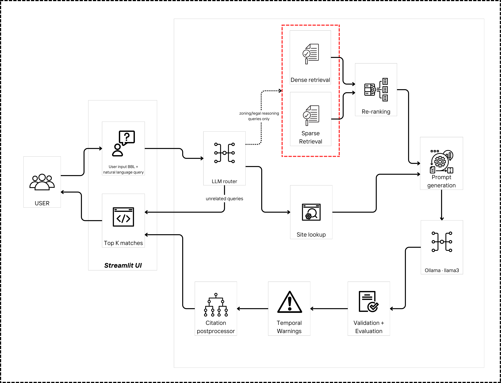

# intelli-site

A site analysis system for architects and AEC professionals that answers natural-language questions about NYC properties, grounded in zoning law and structured site data.

Built as a take-home submission for the Planso Junior AI Engineer assignment.

---

## Demo

📹 [Watch the demo walkthrough on Google Drive](https://drive.google.com/file/d/1dAxcnZGMuo7Pd6kw_aXxo8hB-k5HJGnp/view?usp=sharing)

---

## Architecture



The pipeline accepts a BBL + natural-language question, routes it through an LLM router, performs hybrid retrieval (dense + sparse) for zoning queries, builds a route-aware prompt, generates an answer via local Ollama (llama3), then post-processes with citation grounding, temporal warnings, and a citation appendix before returning the response to the user.

---

## Corpus & Data

Due to file size constraints, the full corpus (including `corpus/structured/pluto_25v4.csv` and the generated Chroma index at `chroma_db/`) is **not included in this repository**. 

📦 [Download the full data corpus from Google Drive](https://drive.google.com/file/d/1dAxcnZGMuo7Pd6kw_aXxo8hB-k5HJGnp/view?usp=sharing)

After downloading, place the files as follows:

```
corpus/
  structured/
    site_records.csv        ← included in repo
    pluto_25v4.csv          ← download from Drive
  zoning/
    zr_01_rules_of_construction.md
    ...                     ← included in repo
chroma_db/                  ← download from Drive
  chroma.sqlite3            
  bm25_index.pkl            
  section_graph.json        
  subsection_chunks.json    
```
Drive link: [Google Drive](https://drive.google.com/drive/folders/1zpOObGJpvl9nBfaO348RA0aP3l_9089A?usp=sharing)
---

## Installation

**Requirements:** Python 3.10+, [Ollama](https://ollama.ai) installed and running locally.

```bash
# Clone the repo
git clone https://github.com/Shubhamsavani/legal-zoning-rag/tree/hybrid-retriever
cd planso_assignment

# Create and activate a virtual environment
python -m venv .venv
source .venv/bin/activate        # Windows: .venv\Scripts\activate

# Install dependencies
pip install -r requirements.txt

# Pull the required Ollama model
ollama pull llama3
```

---

## Environment Variables

Create a `.env` file at the project root:

```env
PROJECT_ROOT=/absolute/path/to/intelli-site
CHROMA_PATH=/absolute/path/to/intelli-site/chroma_db

# Optional (defaults shown)
COLLECTION_NAME=zoning_docs
EMBEDDING_MODEL=all-MiniLM-L6-v2
```

> ⚠️ `PROJECT_ROOT` must be set. The retriever resolves corpus paths relative to it and will fail on startup if it is missing.

---

## Running the System

### Streamlit UI (recommended)

```bash
streamlit run app.py
```

Open [http://localhost:8501](http://localhost:8501). Enter a BBL and a natural-language question. Use the sidebar to adjust `top_k` and the similarity threshold, and toggle chunk/prompt visibility.

### CLI / Python

```python
from src.main import run_pipeline

result = run_pipeline(
    question="Is a rear yard required, and how deep must it be?",
    bbl="1-00835-0001",
    top_k=5,
    threshold=0.38
)
print(result["formatted_response"])
```

---

## Running the Eval

```bash
python eval.py
```

This runs 20 test cases (15 answerable + 5 abstention) against the full pipeline and uses Ollama-as-judge to score grounding and abstention. Results are saved to `logs/eval_results.json`.

> ⚠️ The tests in `src/tests/` are smoke scripts, not clean pytest suites — some call Ollama/retrieval at import time and may hang under `pytest`. Use `python eval.py` as the canonical evaluation command.

---

## Retrieval Transparency

Every query returns a pipeline trace logged to `logs/pipeline_logs.jsonl`. Each log entry includes:

- Route decision (`structured_only`, `legal_rag`, or `reject`)
- Retrieved chunks with their section title, retrieval method, and similarity score
- Temporal/vintage warnings
- Citation validation result
- Final answer
- End-to-end runtime

The Streamlit UI also surfaces retrieved chunks and scores inline when the "Show chunks" toggle is enabled.

---

## Project Structure

```
planso_assignment/
├── app.py                        # Streamlit UI
├── eval.py                       # Evaluation script (20 test cases)
├── requirements.txt
├── .env                          # Not committed
├── corpus/
│   ├── structured/
│   │   ├── site_records.csv
│   │   └── pluto_25v4.csv        # Download from Drive
│   └── zoning/
│       └── zr_01 … zr_10.md
├── chroma_db/                    
├── logs/
│   ├── pipeline_logs.jsonl
│   └── eval_results.json
└── src/
    ├── main.py                   # Pipeline orchestrator
    ├── routing/router.py         # LLM query router
    ├── structured/
    │   ├── loader.py
    │   └── retrieval.py
    ├── retrieval/retriever.py    # Hybrid dense+sparse retriever
    ├── prompt_builder.py
    ├── generation/
    │   ├── llm.py
    │   └── validator.py
    ├── evaluation/
    │   ├── citation_evaluator.py
    │   └── temporal_layer.py
    ├── response_formatter.py
    └── logging/pipeline_logger.py
```
---

## Further Reading

- For a full explanation of every design decision — chunking strategy, retrieval method, routing logic, failure handling, and what would be built next — see [`reasoning.md`](reasoning.md).
- For detailed retrieval metrics and the full 20-case end-to-end evaluation breakdown — see [`eval_stats.md`](eval_stats.md).

---

## Known Limitations

- **Graph key mismatch:** Dependency expansion uses section IDs like `23-341`, but some graph node keys are stored as `23-341_body`. This can cause a section to be reported as missing even when a body node exists. Graph expansion is prototype-level.
- **Ollama latency:** llama3 on CPU is slow (~15–45s per query). A GPU or a faster model (e.g., llama3:8b-q4) will improve throughput significantly.
- **Corpus coverage:** The 10 zoning excerpts intentionally do not cover every question an architect might ask. The system is designed to abstain clearly when coverage is absent.


